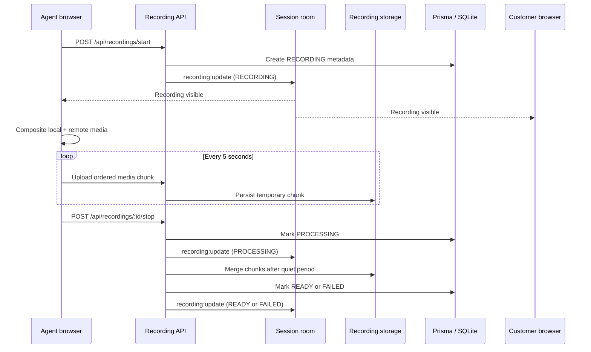

# AtomQuest Call Recording Architecture

## Existing Architecture

- Media is one-to-one WebRTC. Audio and video flow directly between the agent
  and customer browsers; the backend only routes signaling.
- Socket.IO owns room presence, reconnect grace, chat, WebRTC signaling, and
  session-ended broadcasts.
- REST and Prisma own durable session lifecycle data.
- Agents create and end sessions. Customers join from a single-use invite and
  may leave, but cannot end the durable session.
- SQLite is the current durable database.

Because the backend does not receive WebRTC media, recording is captured by the
agent browser, which has access to both the local and remote media streams.

## Architecture



The agent uses `MediaRecorder` over a composite stream:

- A canvas records the remote video as the primary image and the local video as
  picture-in-picture.
- Web Audio mixes local and remote audio into one recording track.
- Ordered chunks upload while recording so a browser crash loses only the most
  recent interval instead of the whole call.

The customer receives recording state only. Customer UI never exposes recording
controls.

## Storage Strategy

- Metadata is stored in the `Recording` Prisma entity.
- In-progress chunks are stored under
  `RECORDING_STORAGE_DIR/.chunks/<recordingId>/`.
- Ready recordings are stored under
  `RECORDING_STORAGE_DIR/<recordingId>.webm`.
- `RECORDING_STORAGE_DIR` defaults to `backend/storage/recordings`.
- The database stores a relative `storageKey`, never an arbitrary absolute path.
- Downloads require the unguessable per-recording download token.

The filesystem implementation is suitable for the current single-node
deployment. The API and metadata model intentionally isolate storage so a
production object-store adapter can replace it without changing browser or
database contracts.

## Database Changes

`Recording` fields:

- `id`
- `sessionId`
- `startedByParticipantId`
- `status`: `RECORDING | PROCESSING | READY | FAILED`
- `stopReason`: `AGENT | SESSION_ENDED | CUSTOMER_DISCONNECTED | RECOVERY`
- `mimeType`
- `startedAt`, `stoppedAt`, `readyAt`
- `durationMs`, `sizeBytes`
- `storageKey`
- `downloadToken`
- `failureReason`
- `createdAt`, `updatedAt`

A session may have multiple recordings over its lifetime, but only one may be
in the `RECORDING` state at a time.

## API Contracts

### Start

`POST /api/recordings/start`

```json
{
  "sessionId": "session-id",
  "participantId": "agent-participant-id",
  "mimeType": "video/webm;codecs=vp8,opus"
}
```

Only an active agent participant may start. Returns `{ "recording": ... }`.

### Upload Chunk

`POST /api/recordings/:recordingId/chunks/:sequence`

- Body: `application/octet-stream`
- Header: `x-atomquest-participant-id: <agent-participant-id>`
- Accepted while status is `RECORDING` or `PROCESSING`.
- Idempotent for the same sequence number.

### Stop

`POST /api/recordings/:recordingId/stop`

```json
{
  "participantId": "agent-participant-id"
}
```

Only an agent may request manual stop. Returns the `PROCESSING` recording.

### List

- `GET /api/recordings`
- `GET /api/recordings?sessionId=<session-id>`

Returns `{ "recordings": [...] }`.

### Download

`GET /api/recordings/:recordingId/download?token=<download-token>`

Only `READY` recordings are downloadable.

## Lifecycle And Recovery

- Agent manual stop: browser flushes final chunks, then requests stop.
- Agent ends session: browser stops recording first; backend also requests stop
  as defense in depth.
- Customer explicitly leaves or exceeds reconnect grace: backend requests stop
  with `CUSTOMER_DISCONNECTED`.
- Any session end requests stop with `SESSION_ENDED`.
- Backend restart moves interrupted `RECORDING` rows to `PROCESSING` with
  `RECOVERY`, then finalizes available chunks.
- Processing waits for chunk writes to become quiet before merging.
- Missing chunks, storage errors, and merge errors persist a `FAILED` state and
  a safe failure reason.

## UI States

| State | Agent call room | Customer call room | Operations |
| --- | --- | --- | --- |
| None | Start recording control | No badge | No recording |
| Recording | Red stop control + recording badge | Recording badge | Recording |
| Processing | Disabled processing control + badge | Processing badge | Processing |
| Ready | Ready badge | Ready badge | Download action |
| Failed | Failed badge and retry guidance | Failed badge | Failure detail |

Recording state is broadcast as `recording:update` to every participant in the
session room and is also loaded from REST on page refresh.

## Security Considerations

- Start, chunk upload, and manual stop validate that the participant belongs to
  the session and has the `AGENT` role.
- Customers cannot invoke recording controls or authorized mutation APIs.
- Chunk size and sequence values are bounded.
- Storage paths are generated server-side and constrained to the recording
  storage root.
- Download URLs require a high-entropy token and are only issued for `READY`
  recordings.
- Raw recording data is not logged.
- Recording state is immutable after `READY` or `FAILED`.
- The current application has no identity/authentication layer. Participant IDs
  and download tokens are the strongest available authorization boundary. A
  production deployment should place these APIs behind authenticated agent and
  operations identities, enforce retention/deletion policy, encrypt object
  storage, and capture recording consent/audit events.
