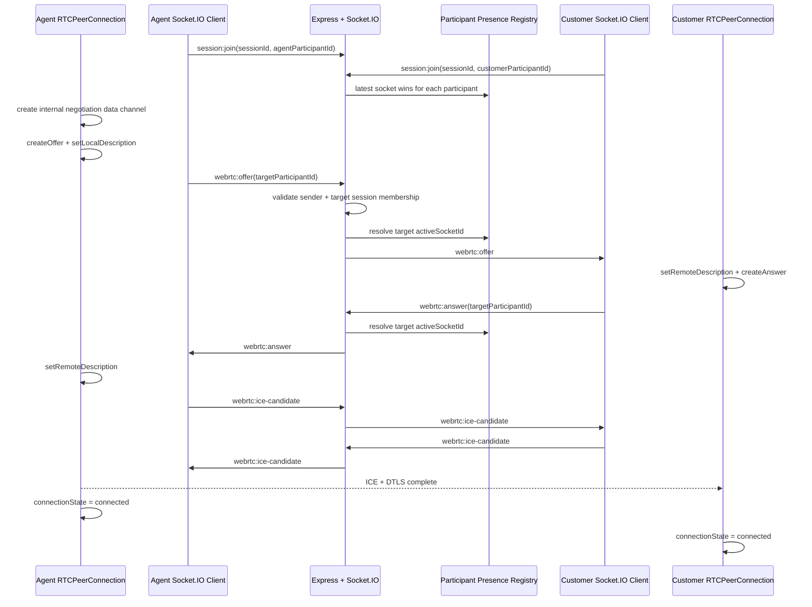

# WebRTC Signaling Layer

## Architecture Diagram



## File Structure

```text
backend/src/webrtc/
  contracts.ts
  signalingHandlers.ts

frontend/src/webrtc/
  index.ts
  peerConnectionService.ts
  signalingClient.ts
  types.ts

backend/tests/
  webrtcSignaling.test.ts
```

## Event Contracts

All client-to-server WebRTC events require an acknowledgement:

```ts
type WebRtcSignalEvent =
  | "webrtc:offer"
  | "webrtc:answer"
  | "webrtc:ice-candidate";

interface WebRtcSignalBasePayload {
  sessionId: string;
  participantId: string;
  targetParticipantId: string;
  messageId?: string;
  sentAt?: string;
}

interface WebRtcOfferPayload extends WebRtcSignalBasePayload {
  description: {
    type: "offer";
    sdp: string;
  };
}

interface WebRtcAnswerPayload extends WebRtcSignalBasePayload {
  description: {
    type: "answer";
    sdp: string;
  };
}

interface WebRtcIceCandidatePayload extends WebRtcSignalBasePayload {
  candidate: {
    candidate: string;
    sdpMid?: string | null;
    sdpMLineIndex?: number | null;
    usernameFragment?: string | null;
  } | null;
}

type SocketAckResponse<TPayload> =
  | { ok: true; data: TPayload }
  | { ok: false; error: SocketErrorPayload };
```

Successful signaling acknowledgements return:

```ts
interface WebRtcSignalAckPayload {
  event: WebRtcSignalEvent;
  sessionId: string;
  participantId: string;
  targetParticipantId: string;
  messageId: string;
  routedAt: string;
}
```

## Backend Behavior

The backend validates every signaling payload before routing:

- `sessionId`, `participantId`, and `targetParticipantId` are required.
- Sender socket must already be joined to `session:{sessionId}`.
- Sender `participantId` must match the joined socket participant.
- Sender and target participants must exist in Prisma and belong to the session.
- Ended sessions and participants with `leftAt` are rejected.
- Target participant must be online in the presence registry.
- Messages are emitted only to `target.activeSocketId`.

The backend never emits WebRTC offers, answers, or ICE candidates to the whole session room.

## Frontend Behavior

`WebRtcSignalingClient` owns the Socket.IO connection and typed acknowledgements.

`AtomQuestPeerConnectionService` owns the browser `RTCPeerConnection`:

- no camera access
- no microphone access
- no video rendering
- no screen sharing
- no chat surface
- no `getUserMedia`

The offerer creates one private data channel labeled `atomquest-webrtc-connection` so the browser has a negotiable SDP section. The service does not expose messaging APIs and does not send application data on that channel.

Minimal connection flow:

```ts
const agentSignaling = createWebRtcSignalingClient();
const customerSignaling = createWebRtcSignalingClient();

await agentSignaling.joinSession({
  sessionId,
  participantId: agentParticipantId,
  role: "AGENT",
});

await customerSignaling.joinSession({
  sessionId,
  participantId: customerParticipantId,
  role: "CUSTOMER",
});

const agentPeer = new AtomQuestPeerConnectionService({
  signalingClient: agentSignaling,
  sessionId,
  participantId: agentParticipantId,
  targetParticipantId: customerParticipantId,
});

const customerPeer = new AtomQuestPeerConnectionService({
  signalingClient: customerSignaling,
  sessionId,
  participantId: customerParticipantId,
  targetParticipantId: agentParticipantId,
});

customerPeer.start();
await agentPeer.createAndSendOffer();

await Promise.all([
  agentPeer.waitUntilConnected(),
  customerPeer.waitUntilConnected(),
]);
```

## Testing Strategy

Automated backend coverage:

- `backend/tests/webrtcSignaling.test.ts` creates a temporary SQLite database.
- It starts the real Socket.IO server on a random local port.
- It joins an agent and customer through the existing `session:join` flow.
- It verifies unavailable targets are rejected with `TARGET_NOT_AVAILABLE`.
- It routes `webrtc:offer`, `webrtc:answer`, and `webrtc:ice-candidate`.
- It verifies the sender does not receive its own offer.

Manual/browser connection test:

- Create an active session and customer participant through the REST flow.
- Join both participants over Socket.IO.
- Start the customer peer service.
- Call `agentPeer.createAndSendOffer()`.
- Assert both services resolve `waitUntilConnected()`.
- Assert both underlying peer connections report `connectionState === "connected"`.

Production ICE note:

- Local browser-to-browser tests can connect with host candidates.
- Real support sessions should pass STUN/TURN servers through `rtcConfiguration.iceServers`.
